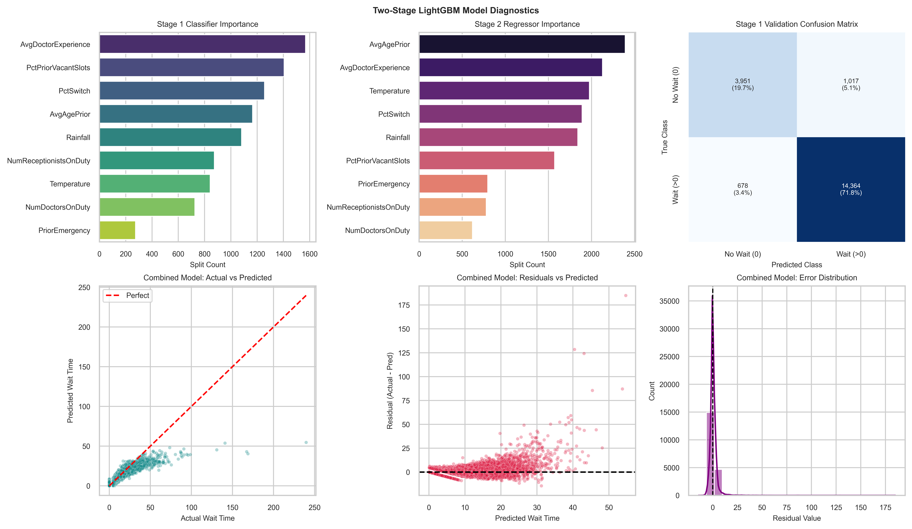
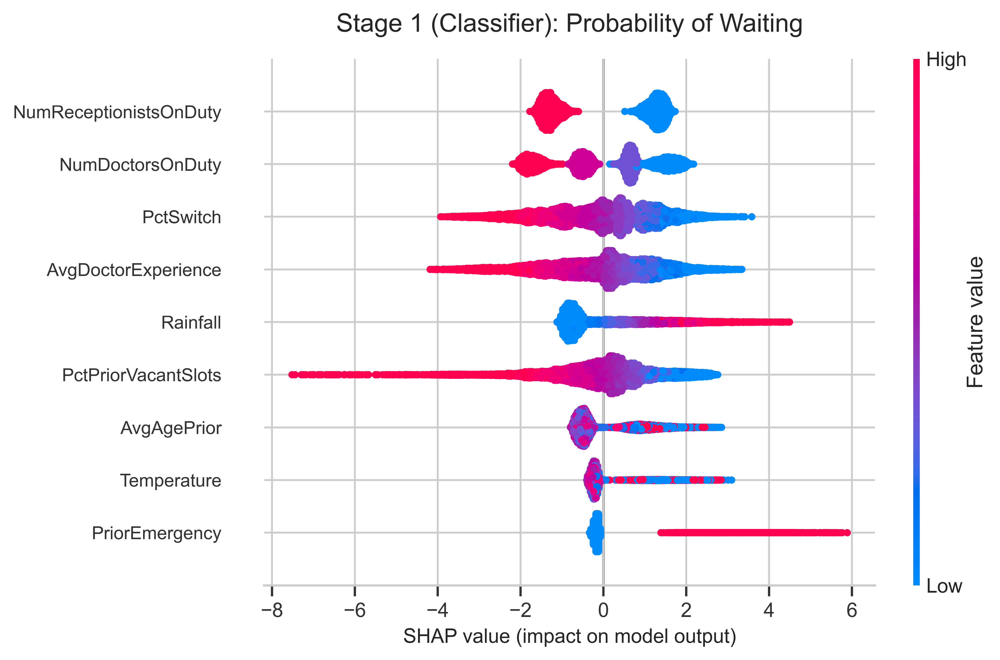
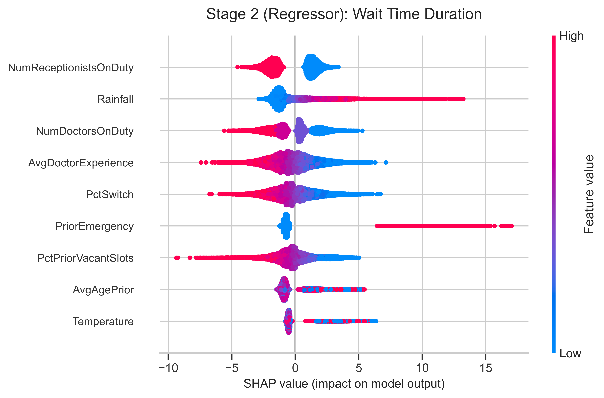

# Indigo Community Services and Health Hub | Waiting Time Predictor

An end-to-end machine learning web application that predicts patient clinic waiting times based on operational variables (such as staff counts, weather conditions, historical client data, and clinic capacity metrics).

🔗 **Live Demo:** [Indigo Waiting Time Predictor](https://clinic-waiting-time-prediction.onrender.com/)

> ⚠️ **Note on Free Hosting:** The live application is hosted on a free Render tier. If the app hasn’t been visited recently, the server will spin down ("go to sleep"). Please allow **30–60 seconds** for the instance to "wake up" upon your first load.

---

## 📁 Project Structure

Following the repository organisation, the core elements are:

```text
├── data/
│   ├── WaitingTimes.csv                # Raw dataset used for modeling, with predicted waiting time
│   └── WaitingTimesDataDictionary.pdf  # Data dictionary for the dataset
├── models/
│   └── lightgbm_2stage_pipeline.enc    # Encrypted production 2-stage LightGBM model
│   └── wtime_diagnostics.png           # Model diagnostic plots (see below)
│   └── wtime_shap_stage1.png           # Stage 1 Classifier SHAP plot (see below)
│   └── wtime_shap_stage2.png           # Stage 2 Regressor  SHAP plot (see below)
├── static/
│   └── css/
│       └── main.css                    # Main styling framework for frontend views
├── templates/
│   ├── CheckWaitingTime.html           # Input form interface for real-time tracking variables
│   └── WaitingTime.html                # Result/ Prediction display interface with model remarks
├── app.py                              # Flask server handling pipeline, decryption, & routing
└── requirements.txt                    # Python library dependencies
```
## ⚙️ Core Components
1. **Data** (`/data`)
   * Contains the foundational raw historical records covering ~100k anonymous patient visits used during the feature engineering and training cycles.
   * Includes predicted waiting time used to cross-verify model accuracy and check baseline prediction metrics.

2. **Predictive Pipeline** (`/models`)
   * Powered by a 2-stage LightGBM (Light Gradient Boosting Machine) architecture engineered to output optimal precision.
   * The model yields a validation error rate of < 2 minutes.
   * The core production pipeline artifact (`lightgbm_2stage_pipeline.enc`) is securely encrypted to protect proprietary model configurations and parameters.
   * Model performance summary:
     ```text
             Two-stage LightGBM Baseline Report
     Metric    Training(80%)    Validation(20%)     Gap
     --------------------------------------------------
     MAE           1.9027            1.9991      0.0964    
     R² Score      0.8113            0.7747      0.0366
     --------------------------------------------------
       ```
    * Model diagnostics:
      
   
    * Drivers (SHAP):
      <p>
        
        
      </p>
      
3. **Frontend Web Interfaces** (`/templates`)
   * A responsive, column-aligned user interface built with semantic HTML structure:
     * `CheckWaitingTime.html`: A clean data-entry dashboard capturing parameters such as staff on duty, temperature, current rainfall, historical room vacancy rates, and priority triage statuses.
     * `WaitingTime.html`: The prediction output display. It features inline structural styles and includes a footnote disclosing the training dataset magnitude and technical architecture validation performance.

4. **Application Logic** (`app.py`)
   * Built on a Flask framework backend.
   * Handles secure decryption of the model asset, maps client parameters submitted via web form inputs into valid array dimensions, triggers model inferences, and renders the predictions dynamically to the client view.

## 🛠️ Technologies Used
**Backend Framework**: Python Flask

**Machine Learning Framework**: LightGBM (Light Gradient Boosting Machine)

**Frontend**: HTML5, CSS3 (Responsive Flexbox/Grid Layout)

**Deployment Cloud**: Render Web Service (free tier)

